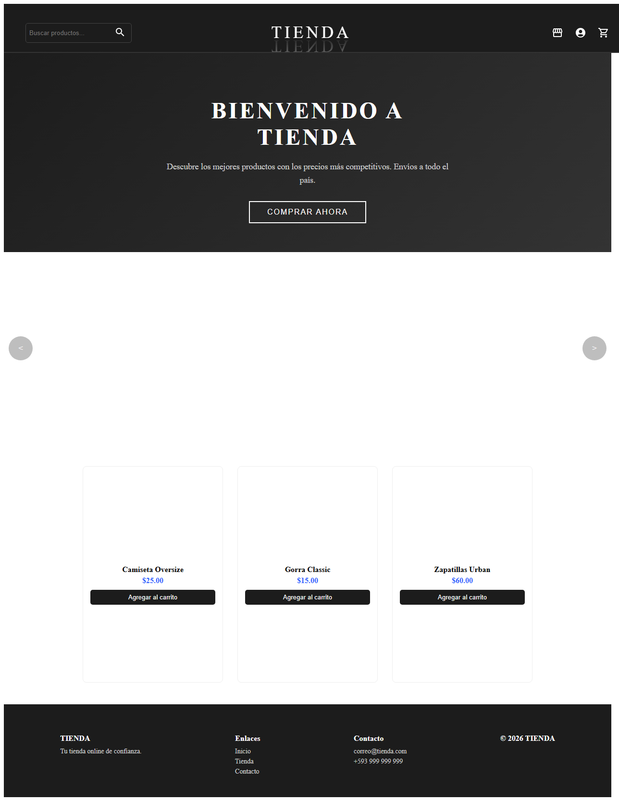
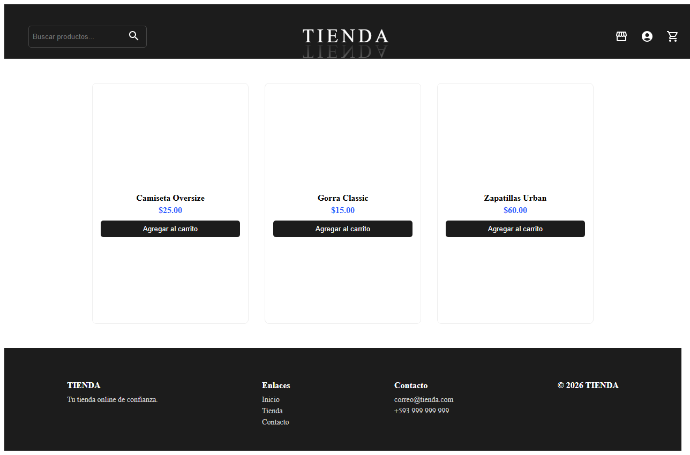
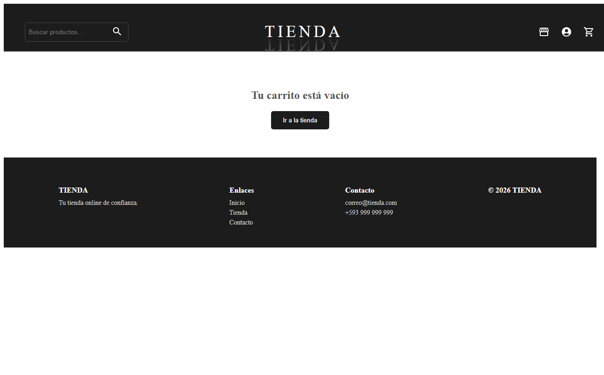
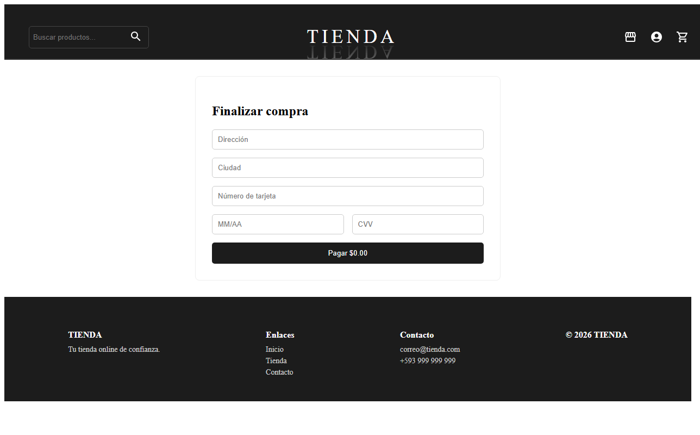
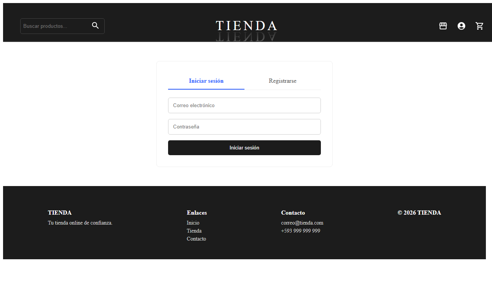
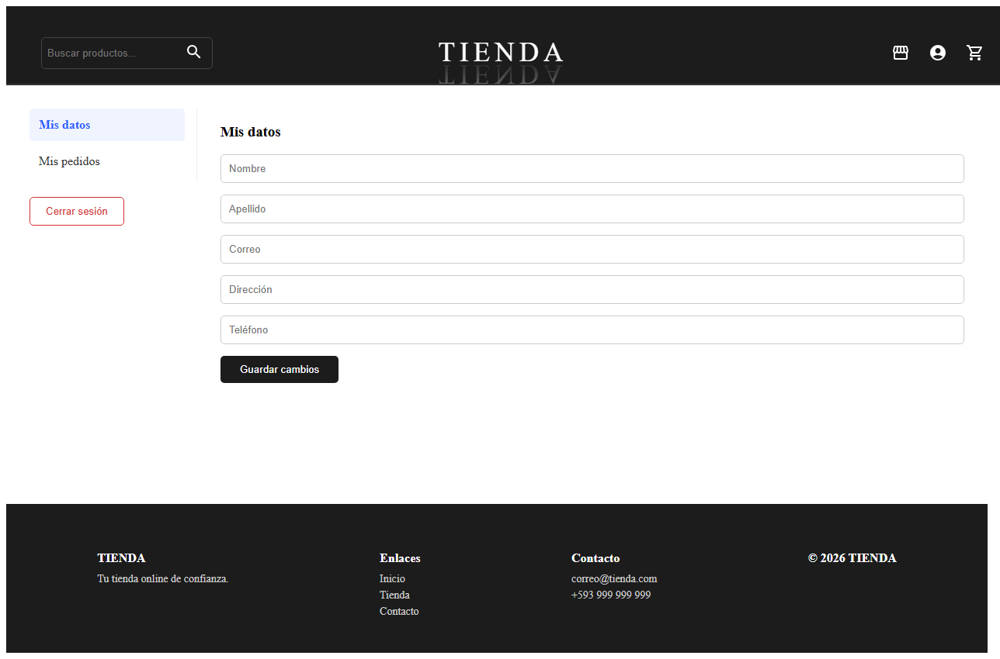
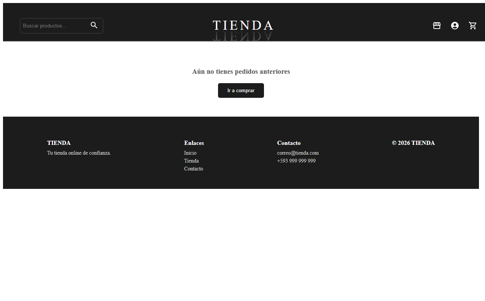

# Frontend Ecommerce

- Jairo Angulo

[](https://github.com/Andres-JA/FrontEnd-React.git)

Aplicación frontend de comercio electrónico construida con **React + TypeScript**. Permite a los usuarios navegar por un catálogo de productos, agregar artículos al carrito, realizar el proceso de pago, registrarse/iniciar sesión y consultar sus pedidos anteriores.

## Objetivo

Desarrollar una interfaz de tienda online funcional y moderna que sirva como frontend para un sistema de ecommerce, demostrando el uso de React con TypeScript, enrutamiento, contexto global, y estilos con styled-components y Material UI.

## Funcionalidades

- **Catálogo de productos** — Visualización de productos con imágenes, nombres y precios.
- **Búsqueda en tienda** — Filtro de productos por nombre en tiempo real.
- **Carrito de compras** — Agregar, eliminar y modificar cantidades de productos.
- **Proceso de pago** — Formulario de checkout con dirección y datos de tarjeta.
- **Registro e inicio de sesión** — Autenticación con persistencia en localStorage.
- **Perfil de usuario** — Visualización y edición de datos personales.
- **Historial de pedidos** — Listado de órdenes anteriores con sus recibos.


## Rutas

| Ruta | Página | Descripción |
|---|---|---|
| `/` | Home | Página principal con banner, carrusel y productos destacados |
| `/shop` | Tienda | Catálogo completo con buscador |
| `/cart` | Carrito | Productos agregados con totales |
| `/checkout` | Pago | Formulario de datos de envío y pago |
| `/login` | Login/Registro | Inicio de sesión y registro de usuario |
| `/profile` | Perfil | Datos personales del usuario |
| `/orders` | Pedidos | Historial de pedidos realizados |

## Capturas de pantalla

### Página principal (`/`)


### Tienda (`/shop`)


### Carrito (`/cart`)


### Proceso de pago (`/checkout`)


### Inicio de sesión / Registro (`/login`)


### Perfil de usuario (`/profile`)


### Historial de pedidos (`/orders`)


## Instalación y ejecución

```bash
# Instalar dependencias
npm install

# Iniciar servidor de desarrollo
npm start

# Ejecutar tests
npm test

# Generar build de producción
npm run build
```

## Scripts disponibles

- `npm start` — Inicia el servidor de desarrollo en `http://localhost:3000`
- `npm test` — Ejecuta el runner de tests en modo interactivo
- `npm run build` — Genera el build de producción en la carpeta `build/`
- `npm run eject` — Expone la configuración de CRA (operación irreversible)

## Estado global

La aplicación utiliza **React Context** para el estado global:

- **`UserContext`** — Manejo de usuarios, autenticación y sesión (persistencia en localStorage).
- **`ProductContext`** — Catálogo de productos, carrito de compras y búsqueda.
